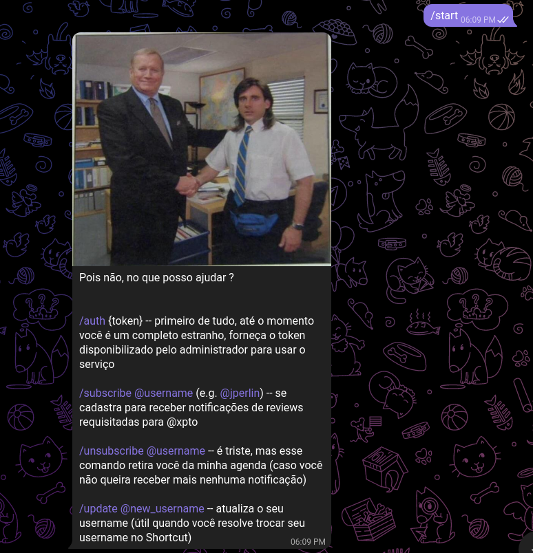
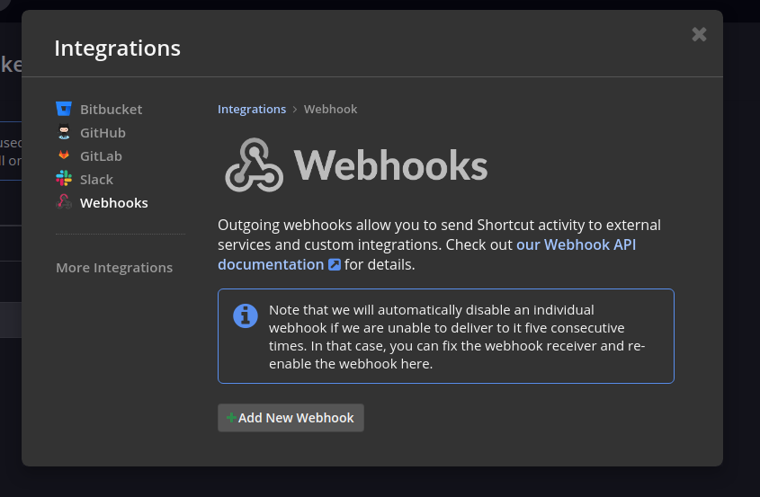
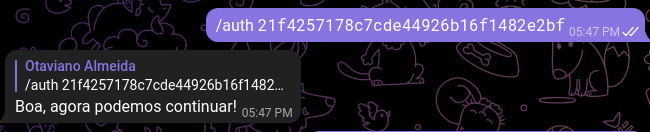
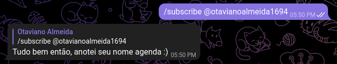
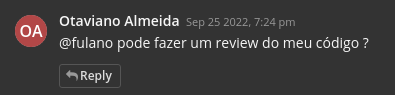
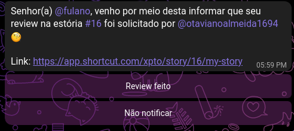
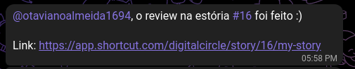
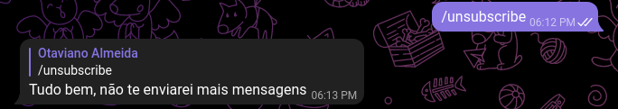

# shortcut-telegram-integration

This project aims to provide an easy integration between Clubhouse's Shortcut and Telegram.

It can be used to automatically send messages notifying pending story reviews




## How to deploy

1 - Docker Compose

```bash

git clone https://github.com/ojalmeida/shortcut-telegram-integration.git

cd shortcut-telegram-integration/deploy

# edit environment variables (mandatory)
vim (or nano) compose/docker-compose.yaml

make deploy-compose

```

2 - Kubernetes (TODO)

## How to integrate

After deploy in a publicly reachable environment, you will need to configure Clubhouse's Shortcut Webhook integration

What can be done in a link like this: https://app.shortcut.com/{organization_name}/settings/integrations/outgoing-webhook



Set webhook as: `http(s)://{domain or IP}/webhook`

> Webhook service listens for requests in /webhook endpoint

## How to use

1. Send `/start` in configured Telegram BOT, you'll receive the following message:


2. Send `/auth {authorization_token}` to be able to properly interact with service, where `{authorization_token}` is a 32 characters long hexadecimal string

> If TELEGRAM_AUTHORIZATION_TOKEN was not set as an environment variable on bot's containers/pods its default value is `21f4257178c7cde44926b16f1482e2bf`



3. Send `/subscribe @{your_shortcut_mention_name}`, this command will enable notification when a review it's asked you



4. Asks for review in a Clubhouse's Shortcut :



5. If, in this case, `fulano` is already subscribed in bot, he will receive a message like this, every two hours (there is a way to configure this):



6. If `fulano` click in `Review feito` button, you'll receive a message like this:



6.1. If `fulano` does not want to be bothered with this review anymore, he can click in "Não notificar" and the notifications to this review will stop, he will be able to signalize that the review as done yet though.

7. If `fulano` or you do not want to receive notifications at all, the `/unsubscribe` command its available



8. If `fulano` or you changed yours Clubhouse's Shortcut name you can update it in the bot via `/update @{new_username}`

## The bot it's not sending review notifications, why ?

Things to check:

1. Check if the url provided in Clubhouse's Shortcut Webhook is right, try `curl` to it
2. Make sure that the user that review was requested is subscribed to bot (see "How to use") 
3. Make sure that your comment in story matches the regexp: `.*\breview\b.*` (https://regexr.com, if you need it)

Well, if everything is OK, please open an issue and explain your problem, I will be glad to help.
